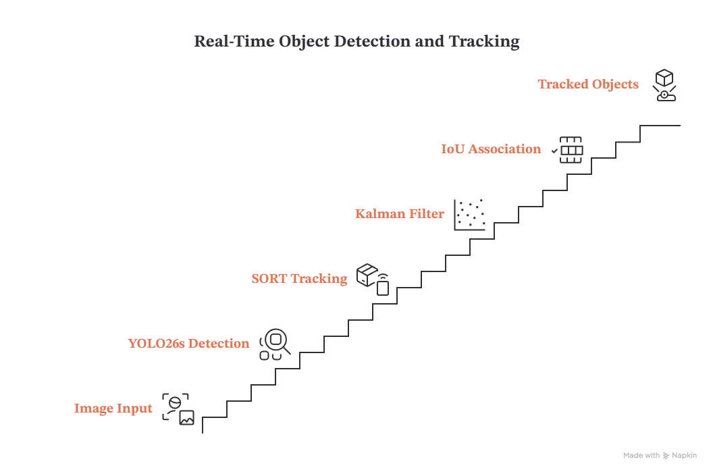

Real-Time Object Detection & Tracking with YOLO26s + SORT

A real-time computer vision system for object detection and multi-object tracking using YOLO26s and SORT.

YOLO26s detects objects in each frame and provides bounding boxes, class labels, and confidence scores. These detections are passed to SORT, which associates objects across consecutive frames and assigns tracking IDs.

System Pipeline

  

Features

Object detection using YOLO26s

Multi-object tracking using SORT

Tracking IDs for detected objects

Image processing

Video processing

Live webcam processing

Network video stream input

Class-specific detection

Optional object blurring

Optional ID-based bounding-box colors

Live FPS display

Active track count

Automatic output saving

Separate detection-only pipeline

Tested with CPU inference

Project Structure

Real-Time Object Detection & Tracking System/
│
├── obj_det_and_trk.py      # YOLO26s detection + SORT tracking
├── ob_detect.py            # Detection-only pipeline
├── sort.py                 # SORT tracker implementation
├── utils/                  # Utilities used by detection-only pipeline
│
├── yolo26s.pt              # YOLO26s model weights
├── test.jpg                # Sample image
├── test.mp4                # Sample video
│
├── requirements.txt        # Python dependencies
├── README.md
├── LICENSE
└── .gitignore

Installation

1. Create a virtual environment

python -m venv venv

2. Activate the environment

Windows:

venv\Scripts\activate

3. Install dependencies

pip install -r requirements.txt

Run Detection and Tracking

Live Webcam

python obj_det_and_trk.py --source 0 --view-img

Video File

python obj_det_and_trk.py --source test.mp4 --view-img

Image

python obj_det_and_trk.py --source test.jpg --view-img

Network Stream

python obj_det_and_trk.py --source "rtsp://your-stream-url" --view-img

Press Q to stop video or webcam processing.

Detection Only

Image

python ob_detect.py --weights yolo26s.pt --source test.jpg --view-img

Video

python ob_detect.py --weights yolo26s.pt --source test.mp4 --view-img

Additional Options

Track a Selected Class

Example using class ID 0:

python obj_det_and_trk.py --source test.mp4 --classes 0 --view-img

Blur Detected Objects

python obj_det_and_trk.py --source test.mp4 --blur-obj --view-img

ID-Based Bounding-Box Colors

python obj_det_and_trk.py --source test.mp4 --color-box --view-img

Run Without Saving Output

python obj_det_and_trk.py --source 0 --view-img --nosave

Current Tracking Configuration

Detector          : YOLO26s
Weights           : yolo26s.pt
Image Size        : 640
Confidence        : 0.60
IoU Threshold     : 0.45
Device            : CPU

Tracker           : SORT
SORT Max Age      : 15
SORT Min Hits     : 2
SORT IoU          : 0.20

The 0.60 confidence threshold is the current default for the detection-and-tracking pipeline.

YOLO26s inference in the tracking pipeline is explicitly called with:

end2end=False

How Tracking Works

For every processed frame, YOLO26s produces detections in the form:

x1, y1, x2, y2, confidence, class_id

The detections are then passed to SORT.

SORT uses:

a Kalman Filter for motion estimation

Intersection over Union (IoU) for comparing bounding boxes

linear assignment for associating detections with existing tracks

track age and hit information for maintaining track state

The tracker is updated on every processed frame, including frames where no detections are returned.

Runtime Display

Tracked objects are displayed with their class and tracking ID.

Example:

person | ID: 1
car | ID: 2

For video and webcam input, runtime information is displayed in the top-left corner:

FPS: <current FPS> | Active Tracks: <count>

FPS

Represents the approximate processing rate of the current detection-and-tracking loop.

Active Tracks

Represents the number of tracks returned by SORT for the current frame.

It is not a cumulative count of every object seen during the complete video.

Image vs Video Tracking

Single Image

For an image:

YOLO26s performs object detection

SORT can assign IDs to detections in that processed frame

there is no motion history between frames

Video / Webcam

For sequential input:

YOLO26s generates detections frame by frame

SORT predicts track positions

new detections are associated with existing tracks

tracking IDs can remain consistent across consecutive frames

Output

Processed results are saved inside:

runs/detect/

Each new run receives an incremented output directory:

runs/detect/exp/
runs/detect/exp2/
runs/detect/exp3/
...

For a video such as:

test.mp4

the tracking pipeline saves an output file in the corresponding run directory, for example:

test_tracked.mp4

A typical tracking run reports the active configuration in the terminal:

==============================
DETECTOR : yolo26s
WEIGHTS  : yolo26s.pt
TRACKER  : SORT
DEVICE   : CPU
IMAGE SIZE : 640
CONFIDENCE : 0.6
IOU        : 0.45
==============================

Detection and tracking started.
Press Q to stop.

After processing stops, the saved output path is printed in the terminal.

Tracking Limitations

Detection is limited to the classes supported by the loaded pretrained model.

Detection results can vary with lighting, object size, camera angle, motion blur, distance, and occlusion.

SORT tracks objects using motion information and bounding-box overlap.

SORT does not use appearance-based re-identification.

Tracking IDs may change during difficult or extended occlusions.

An object that leaves the scene and later returns may receive a new tracking ID.

Processing speed depends on the model, input resolution, scene, and hardware.

License

This project is distributed under the GNU Affero General Public License v3.0 (AGPL-3.0).

See the LICENSE file for the complete license terms.

References

Ultralytics YOLO

SORT: Simple Online and Realtime Tracking